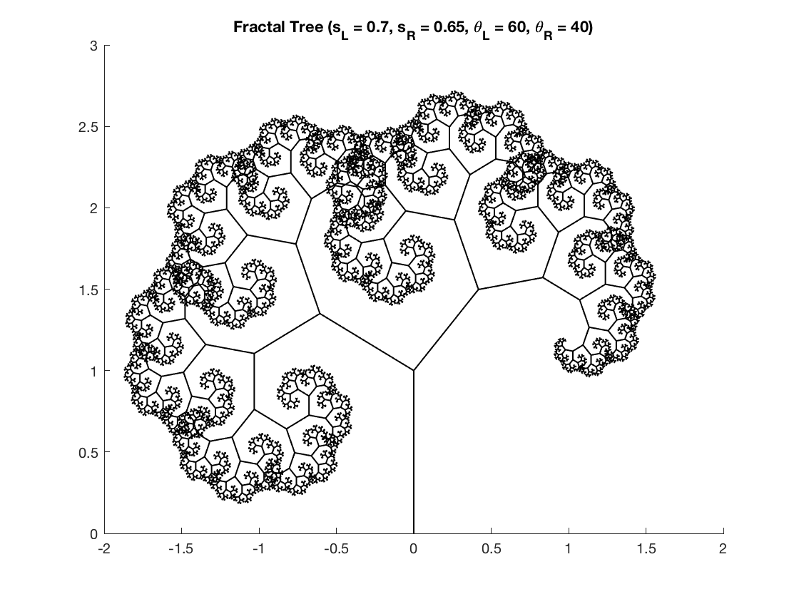

# Chaotic Dynamics - Fractals

## Fractal Trees

Computes a fractal tree by iteratively creating two new "branches" in left and right direction by creating a line in each corresponding direction, where it then scales the line's maginitude by given scale factor, and then multiplies this by a transfomation matrix to rotate the left and right branches in their corresponding direction by $ \theta^{\circ}$. The base case is set as a counter that decrements each iterative cycle.

### **Part a.)**
Creating a fractal tree with left and right branches emanating from the trunk at right angles scaling each branch by a scale factor of $s = 0.6$, gives the following plot after iterating 12 times (when successive segments could no longer be differentiated).  

|      |
|:-------------------------------------:|
| Fractal Tree ( $s = 0.8 $ )           |
 

### **Part b.)**
When the scale factor is decreased to exactly half, where each preceding line segment is half as long as the line segment before it, the tree becomes more sparse. By this I mean, the leaves on the tree become more concentrated near the first two branches from the trunk. As the scale factor is reduced even further towards zero, the leaves approach points around the first two branches where these branches are too approaching points. When the scale factor is increased, the tree expands and takes up a much larger portion of the plotting space. Since each line segment is larger as the scale factor is now larger, the naked eye can visualize more of the self similar branches, which are now expanded. This shows that the larger the scale factor - the easier it is for our eyes to witness each iteration of the new branches, where smaller scale factors shrink the image allowing the naked eye to see less branches.  

### **Part c.)**

Now applying different angles between the left and right branches ($\theta_l$ and $\theta_r$) and different segment length ratios between the left and right branches ($s_l$ and $s_r$) yields the following result:  

|      |
|:------------------------------------------------:|
| Fractal Tree ( $\theta_l = 60^{\circ}$, $\theta_r = 40^{\circ}$, $s_l = 0.7$, $s_l = 0.7$)       |
 

### **Part d.)**
Some interesting plots were also found imputing random angles and ratios and are plotted below:  

 

      

